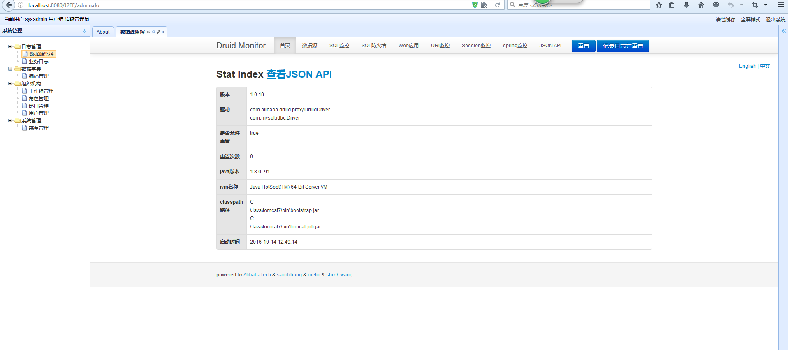
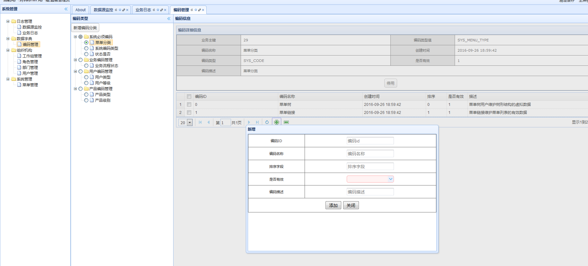
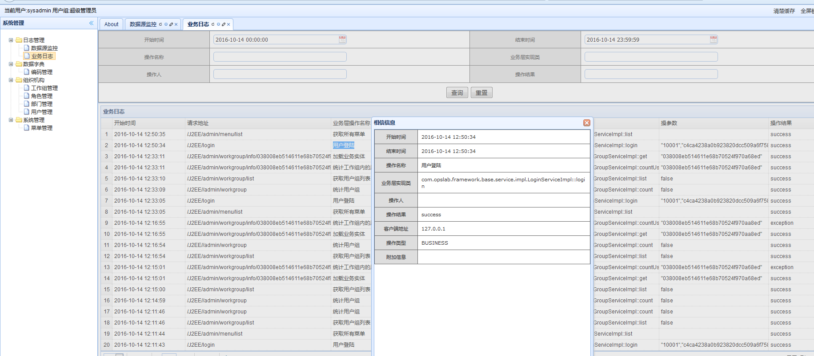
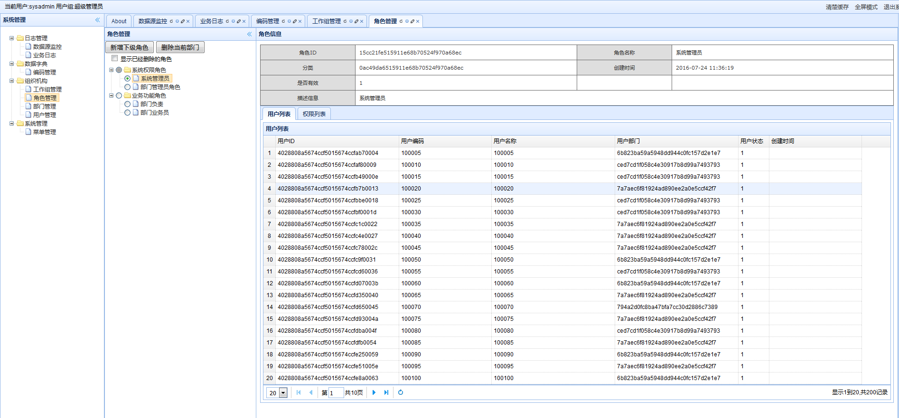

# SpringSSHibernate
---
提供一个J2EE应用程序最基本的框架.一个包含用户管理、角色管理、工作组管理、权限管理、菜单管理、编码管理的J2EE WEB应用的基础框架

## 架构
>* SpringMvc
>* Spring
>* Hibernate
>* druid
>* easyui
>* jquery
>* ztree
>* bootstrap


## 开发环境
  Win7x64 && ubuntu14
  JDK1.7
  IDEA14

## 后台API
系统集成了Hibernate和Spring，数据源使用了Druid，同时也集成了dbutils。因此能很方便的完成各种方式的于数据库的交互，这些方式包括jdbcTemplate、namedParameterJdbcTemplate、sessionFactory、dbutils等方式
### sessionFactory
系统通过com.opslab.framework.base.dao.SupportDao<T, ID extends Serializable>类定义了统一完整的以hibernate方式于数据库交互的API,这些API包括

```java
    /**
     * 返回一个count语句的查询结果
     */
    Long count(String hql, Object... params)
    /**
     * 使用原生的sql count语句进行统计
     */
    Long countSQL(String sql, Object... params)
    /**
     * 统计任意一个SQL的执行结果记录数
     */
    Long countCommonSQL(String sql, Object... params)
    /**
     * 保存实体
     */
    void save(T t)
    /**
     * 更新实体
     */
    void update(T t)
    /**
     * 保存或更新
     */
    void saveOrUpdate(T t)
    /**
     * 删除实体
     */
    void delete(T t)
    /**
     * 删除实体
     */
    void deleteById(ID id)
    /**
     * 删除实体
     */
    void deleteAll(Collection<T> entities)
    /**
     * 加载实体
     */
    T load(ID id)
    /**
     * 加载实体
     */
    T get(ID id)
    /**
     * 使用HQL获得实体列表
     */
    List<T> query(String hql, Object... params)
    /**
     * 使用HQL获取实体列表支持分页
     */
    List<T> queryPage(String hql, int page, int size, Object... params)
    /**
     * 使用HQL获取其他类型的实体列表
     */
    List<Object> queryEntity(String hql, Object... params)
    /**
     * 使用HQL获取其他类型的实体列表支持分页
     */
    List<Object> queryEntityPage(String hql, int page, int size, Object... params)
    /**
     * 使用SQL查询指定类型的实体列表
     */
    List<Object> querySQLEntity(Class clazz, String sql, Object... params)
    /**
     * 使用SQL查询指定类型的实体列表支持分页
     */
    List<Object> querySQLEntityPage(Class clazz, String sql, int page, int size, Object... params)
     /**
     * 使用SQL查询并返回一个Object[]的列表
     */
    List<Object[]> queryArray(String sql, Object... params)
    /**
     * 使用SQL查询并返回一个Object[]的列表支持分页
     */
    List<Object[]> queryArrayPage(String sql, int page, int size, Object... params)
    /**
     * 通过HQL查询单个实体
     */
    T queryFirst(String hql, Object... params)
    /**
     * 通过HQL查询单个其他类型的实体
     */
    Object queryFirstEntity(String hql, Object... params)
    /**
     * 通过SQL查询单个实体
     */
    Object queryFirstSQLEntity(Class clazz, String sql, Object... params)
    /**
     * 使用SQL查询并以Object[]的方式返回第一行结果集
     */
    Object[] queryFirstArray(String sql, Object... params)
    /**
     * 通过HQL查询单个实体
     */
    T queryLast(String hql, Object... params)
    /**
     * 通过HQL查询其他类型的单个实体
     */
    Object queryLastEntity(String hql, Object... params)
    /**
     * 使用SQL查询并以Object[]的方式返回最后一行行结果集
     */
    Object[] queryLastArray(String sql, Object... params)
    /**
     * 使用SQL查询并以Object[]的方式返回最后一行行结果集
     */
    Object[] queryLastArray(String sql, Object... params)
    /**
     * 查询分页
     */
    Page page(String hql, Long count,int page, int size, Object... params)
    /**
     * 使用sql查询指定类型的对象的分页
     */
    Page page(Class clazz, String sql, int page, int size, Object... params)
```
其他其中方式的使用原始API与数据进行交互，因为那样有更多的选择

# service
service的API是对DAO层的API进行了响应的包装，具体的业务API需要更加自己情况时限.系统已经实现一个通用的父类SupportService。
该类中定义和实现了基础的业务方法。同时该类中有具有三个属性方便执行数据相关的操作：
```java
    //方便快捷的执行Hibernate的HQL语句
    @Autowired
    protected SupportDao<T,ID> db;

    //方便快捷的执行以Hibernate管理的映射表相关的元素SQL
    @Resource(name="dbSql")
    protected DBDao dbSql;

    //方便快捷的实现原始的SQL语句
    @Resource(name="dbUtils")
    protected DBUtil dbUtil;
```

### 系统标签
在包com.opslab.framework.base.tag下实现系统核心的一些JSP标签,此处只是通过一个全局的集合对象实现了，建议大系统中以缓存等方式实现
,例如Redis等
### usgae
```java
//显示编码名称
<opslab:code type="${code.codeType}" id="${code.codeId}"/>
//显示部门名称
<opslab:dept id="${dept.parentId}"/>
```

### 系统截图




